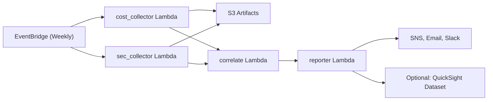

# CostSecurity – Cost × Security Correlation Alerts
> 비용 급등과 보안 이벤트의 동시 발생을 주간 단위로 탐지·경보하는 서버리스 워크로드
>
> **태그라인:** “요금 급등 + 보안 이벤트 동시 발생을 조기에 탐지”

**⚠️ 비밀값(Secret)은 README나 코드에 절대 기록하지 마십시오. 반드시 AWS Secrets Manager / SSM Parameter Store 등을 사용하세요.**

---

## 목차
- [프로젝트 소개](#프로젝트-소개)
- [한눈에 보는 핵심 기능](#한눈에-보는-핵심-기능)
- [빠른 시작(Quick Start)](#빠른-시작quick-start)
- [설정/구성](#설정구성)
- [아키텍처 개요](#아키텍처-개요)
- [운영 방법(운영-sre)](#운영-방법운영-sre)
- [CI/CD 통합 가이드](#cicd-통합-가이드)
- [보안·컴플라이언스](#보안컴플라이언스)
- [기여 가이드](#기여-가이드)
- [테스트 및 검증](#테스트-및-검증)
- [FAQ](#faq)
- [변경 이력/릴리스](#변경-이력릴리스)
- [라이선스](#라이선스)
- [연락처/지원](#연락처지원)

---

## 프로젝트 소개
- **문제정의:** “요금 급등 + 보안 이벤트 동시 발생을 조기에 탐지” – 비용 팀과 보안 팀이 각각 Cost Explorer(Cost Explorer, CE)와 Security Hub/GuardDuty를 따로 모니터링하면서 대응이 늦어지는 문제를 해결합니다.
- **주요 기능:**
  - 비용/보안 데이터 수집 (Lambda 기반 cost_collector, sec_collector)
  - Δ% 증가율 + robust z-score 기반 상관/이상치 분석
  - 규칙 엔진(RULE_COST30_SEC_HIGH 등)과 False Positive suppress 관리
  - 주간 Markdown/HTML 리포트 + SNS/Slack 알림, S3 JSON/CSV 보관 (옵션: QuickSight 연동)
  - EventBridge 주간 스케줄러와 AWS SAM IaC 제공
- **기대 효과:** 사고 대응 시간 단축, 알림 노이즈 감소, 운영 가시성 향상 및 비용·보안 팀 협업 강화.

---

## 한눈에 보는 핵심 기능
| 범주 | 설명 |
| --- | --- |
| 비용 수집 | AWS Cost Explorer API에서 계정/리전/서비스별 주간·일일 비용 집계 |
| 보안 수집 | Security Hub, GuardDuty(옵션 CloudTrail@Athena) finding 수집 |
| 이상 탐지 | Δ% 증가율 + robust z-score 기반 cost anomaly 계산 |
| 룰 엔진 | 비용 급등 + 보안 Severity 조합, GuardDuty threat spike 등 룰 매칭 |
| 오탐 관리 | `.falsepositives.json` 기반 suppress, until 만료 자동 해제 |
| 리포트 | Markdown/HTML 요약, SNS/Slack 통보, JSON/CSV S3 저장 |
| 스케줄러 | EventBridge 주간 cron → Lambda 파이프라인 |
| 대시보드(옵션) | QuickSight manifest 생성기로 S3 데이터를 시각화 |

---

## 빠른 시작(Quick Start)
### 요구사항
- Python 3.11
- AWS CLI v2, SAM CLI
- 권장: `python3 -m venv` 가상환경

### 설치 & 의존성
```bash
python3 -m venv .venv
source .venv/bin/activate
pip install --upgrade pip
pip install -r requirements.txt
```

### 환경변수 설정
1. `.env.example` 복사 → `.env` 편집
2. **⚠️ 실제 비밀은 `.env`에 직접 적지 말고 AWS Secrets Manager / SSM Parameter Store에서 로드하세요.**

### 로컬 드라이런(샘플 데이터)
```bash
make dry-run
# 결과: artifacts/weekly_report.json, .tmp/ 이하 JSON/CSV 생성
```

### (옵션) 배포
```bash
sam build
sam deploy --guided  # 예: Stack Name = costsecurity-dev
```

---

## 설정/구성
- `.env.example` 주요 항목
  - `AWS_REGION`: 배포 리전 (예: `us-east-1`)
  - `REPORT_BUCKET`: 리포트/아티팩트 저장 S3 버킷
  - `REPORT_TOPIC_ARN`: SNS Topic ARN
  - `DELTA_THRESHOLD`: Δ% 임계값 (기본 30)
  - `ZSCORE_THRESHOLD`: Robust z-score 임계값 (기본 2.0)
  - `SEVERITY_MIN`: 최소 보안 Severity (예: MEDIUM)
  - `SLACK_WEBHOOK_URL` (옵션): Slack 알림용 웹훅 URL
  - `DRY_RUN`: `true` 설정 시 S3 대신 `.tmp/` 로컬 저장
- **비밀/자격증명**: Secrets Manager / SSM Parameter Store 권장, README나 코드에 비밀값 기록 금지.
- **IAM 최소 권한 예시** (필요 시 계정/리전/리소스 범위로 축소):
```json
{
  "Version": "2012-10-17",
  "Statement": [
    {
      "Sid": "CostExplorerAccess",
      "Effect": "Allow",
      "Action": ["ce:GetCostAndUsage"],
      "Resource": "*"
    },
    {
      "Sid": "SecurityDataAccess",
      "Effect": "Allow",
      "Action": [
        "securityhub:GetFindings",
        "guardduty:ListDetectors",
        "guardduty:GetFindings"
      ],
      "Resource": "*"
    },
    {
      "Sid": "ReportStorage",
      "Effect": "Allow",
      "Action": ["s3:GetObject", "s3:PutObject"],
      "Resource": ["arn:aws:s3:::<REPORT_BUCKET>/*"]
    }
  ]
}
```

---

## 아키텍처 개요

- EventBridge가 주간 cron으로 비용/보안 수집기를 호출
- Collector 출력은 S3에 저장되고 correlate Lambda가 이상 탐지 및 suppress 룰 평가
- Reporter Lambda가 SNS/Slack 통보 및 S3 JSON/CSV 보관, QuickSight 연동 시 manifest 제공

---

## 운영 방법(운영-SRE)
- **로그 위치**: CloudWatch Logs 그룹
  - `/aws/lambda/CostCollectorFunction`
  - `/aws/lambda/SecCollectorFunction`
  - `/aws/lambda/CorrelateFunction`
  - `/aws/lambda/ReporterFunction`
- **헬스체크/모니터링**: Lambda 오류율, `CostSecurity/CollectedRecords`, `CostSecurity/CorrelatedSignals`, `CostSecurity/NotificationsSent`
- **장애 복구 한 줄 요약**: CloudWatch Logs 확인 → 수집기 재시도 → FP suppress 등록(기간) → 권한/할당량 점검
- **복구 절차 (예시)**
  1. CloudWatch Logs에서 오류 메시지 확인
  2. 실패한 Lambda를 수동 재시도(`sam remote invoke` 또는 콘솔 Test)
  3. `DRY_RUN=true`로 로컬 재현해 suppress 또는 임계값 조정 필요 여부 확인
  4. IAM 권한, Cost Explorer API RateLimit, Security Hub/GuardDuty 활성화 상태 검토
  5. 필요 시 AWS Support로 API 할당량 상향 또는 스케줄 조정
- **흔한 이슈**
  - Cost Explorer RateLimit: 백오프 확장, Lookback 기간 축소, 야간 실행
  - Security Hub 권한 부족: `securityhub:GetFindings` cross-account 권한 확인
  - GuardDuty 미활성: Organization 관리자 계정에서 Detector 활성화 여부 체크

---

## CI/CD 통합 가이드
- **CodeBuild buildspec** (pipeline/buildspec.yml)
  - pre_build: `pip install -r requirements.txt`, `pytest -q`
  - build: `python -m src.correlate.handler --dry-run --use-sample-data ...`, `python -m src.reporter.handler ...`
  - post_build: `artifacts/weekly_report.json` 요약 출력 및 업로드
- **CodePipeline 단계**
  1. Source (CodeCommit or GitHub)
  2. Build (CodeBuild)
  3. Manual Approval (옵션)
  4. Deploy (CloudFormation/SAM)
- **파이프라인 변수**: `SEVERITY_MIN`, `DELTA_THRESHOLD`, 필요 시 `ENV_NAME`, `REPORT_BUCKET`

---

## 보안·컴플라이언스
- **비밀 관리**: AWS Secrets Manager / SSM Parameter Store, AWS KMS 암호화 사용
- **최소권한(IAM)**: Lambda별 필요한 API만 허용, S3/SNS/Cost Explorer/GuardDuty 범위 축소
- **로그/데이터 보존**: 수집 원본은 90~365일 보관 권장, CloudWatch Logs 만료 정책 설정
- **취약점 신고**: [SECURITY.md](./SECURITY.md)
- **표준 매핑 요약**
  - NIST SP 800-53: AC-6(Least Privilege), AU-6(Audit Review), SI-4(System Monitoring)
  - ISO/IEC 27001: A.9(Access Control), A.12.6(Technical Vulnerability Mgmt)
  - AWS Well-Architected Framework(Security Pillar)

---

## 기여 가이드
- [CONTRIBUTING.md](./CONTRIBUTING.md) 참고
  - 브랜치 전략: `main` 보호, `feature/*`, `fix/*`
  - 커밋: Conventional Commits
  - PR 체크리스트: 테스트 통과, 문서 업데이트, 리뷰어 승인

---

## 테스트 및 검증
- 실행: `pytest -q`
- 샘플 데이터 상관 룰 검증: `make dry-run` 후 `cat artifacts/weekly_report.json | jq .`
- `artifacts/weekly_report.json` 샘플 (일부)
  ```json
  [
    {
      "account_id": "123456789012",
      "region": "us-east-1",
      "service": "AmazonEC2",
      "cost_delta_pct": 67.4,
      "cost_anomaly_score": 3.2,
      "sec_counts": {"CRITICAL": 1, "HIGH": 1},
      "matched_rules": ["RULE_COST30_SEC_HIGH", "RULE_GD_THREAT_COSTSPIKE"],
      "evidence": {"cost": [...], "findings": [...]} 
    }
  ]
  ```

---

## FAQ
1. **CE/SH/GD 최소 권한은?**  
   `ce:GetCostAndUsage`, `securityhub:GetFindings`, `guardduty:GetFindings` 권한을 계정/리전 단위로 허용하고 나머지는 제한하십시오.
2. **오탐 줄이는 법?**  
   `.falsepositives.json` suppress 등록, Δ%/z-score 조정, Security Hub Severity 필터 조정.
3. **QuickSight 연동은?**  
   Reporter가 저장한 S3 JSON/CSV를 QuickSight 데이터셋으로 로딩. `build_quicksight_manifest` 함수 참고.
4. **다계정 조직 지원?**  
   Organization 관리자 계정에서 Security Hub/GuardDuty Aggregation 활성화 및 cross-account IAM 역할 설정 필요.
5. **CloudTrail@Athena 사용법?**  
   `ct_athena.py`에 Athena 쿼리 구현 후 CloudTrail 데이터셋 연결. 비용 증가와 API 이벤트를 추가 상관 분석.

---

## 변경 이력/릴리스
- [CHANGELOG.md](./CHANGELOG.md) 또는 Releases 페이지 참고 (초기 버전 이후 기록 예정)

---

## 라이선스
- [LICENSE](./LICENSE) (예: MIT) – 조직/정책에 맞게 변경 가능

---

## 연락처/지원
- 일반 문의/버그: GitHub Issues
- 취약점 신고: security@example.com (예시)
- 긴급 지원: 내부 DevSecOps on-call (사내 채널)
