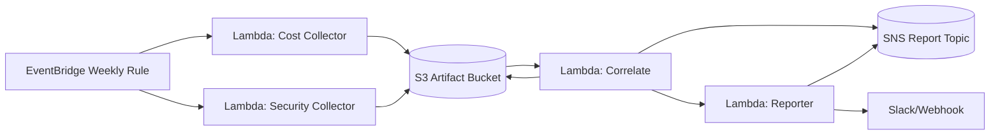

# Cost × Security Correlation Platform

## 소개
- **문제 정의**: 퍼블릭 클라우드에서 비용 급등과 보안 이벤트가 동시에 발생할 때 빠르게 감지·경보하는 것은 어렵습니다. 개별 팀은 Cost Explorer, Security Hub, GuardDuty 데이터를 각각 수동 분석하며 오탐과 누락 위험을 안고 있습니다.
- **핵심 기능**: 주간 비용/보안 수집 → 정규화 → 상관/이상치 분석 → 룰 매칭 → SNS/Slack 보고 및 S3 아카이브.
- **기대 효과**: 비용 과다 지출과 보안 리스크의 동시 감지를 통해 대응 시간을 단축하고, 오탐 관리와 리포트 자동화를 통해 운영 효율을 높입니다.

## 빠른 시작
```bash
# 1. 가상환경
python3 -m venv .venv
source .venv/bin/activate

# 2. 패키지 설치
pip install --upgrade pip
pip install -r requirements.txt

# 3. SAM 빌드/배포
sam build
sam deploy --guided

# 4. 로컬 DRY_RUN 시나리오
export DRY_RUN=true
python -m src.correlate.handler --dry-run --use-sample-data --out artifacts/weekly_report.json
python -m src.reporter.handler --dry-run --in artifacts/weekly_report.json
```

## 설정
- `.env`를 `.env.example` 기반으로 작성: `AWS_REGION`, `REPORT_BUCKET`, `REPORT_TOPIC_ARN`, 임계치 등.
- 운영 환경은 **SSM Parameter Store**(구성) + **Secrets Manager**(민감정보) 사용 권장.
- `SUPPRESS_CONFIG_URI`로 `.falsepositives.json` 위치를 지정하면 런타임 suppress 적용 가능.

## 아키텍처


## 운영
- **로그**: `/aws/lambda/CostCollectorFunction`, `SecCollectorFunction`, `CorrelateFunction`, `ReporterFunction` (CloudWatch Logs).
- **헬스 지표**: `CostSecurity/CollectedRecords`, `CostSecurity/CorrelatedSignals`, `CostSecurity/NotificationsSent`.
- **복구 절차**: 로그 확인 → 문제 Lambda 수동 재시도 → DRY_RUN 재현 → 필요하면 suppress 등록 → 권한·키 점검.

## 오탐 관리
- 구성 파일 예시 (`.falsepositives.json`):
  ```json
  {
    "suppress": [
      {
        "account_id": "123456789012",
        "service": "AmazonS3",
        "reason": "데이터 마이그레이션",
        "until": "2025-12-31T00:00:00Z"
      }
    ]
  }
  ```
- `until` 시각이 만료되면 suppress가 자동 해제되므로 주기적으로 검토하십시오.

## CI/CD
- **BuildSpec**: `pipeline/buildspec.yml`
  - `pytest -q` → 상관/리포트 dry-run → `artifacts/weekly_report.json` 저장 및 요약 출력.
- **파이프라인 변수**: `SEVERITY_MIN`, `DELTA_THRESHOLD`는 CodeBuild 환경 변수로 주입 가능.

## 보안·컴플라이언스 근거
- **NIST AC-6**(Least Privilege), **SC-7**(Boundary Protection) 적용: Lambda별 최소 IAM 권한, 네트워크 경계(API throttling) 설계.
- **ISO/IEC 27001 A.9**(Access Control), **A.12.6**(Technical Vulnerability Management) 준수: 권한 분리, 비정상 비용/보안 이벤트 모니터링.

## 주간 리포트 샘플
- **JSON (요약)**
  ```json
  [
    {
      "account_id": "123456789012",
      "region": "us-east-1",
      "service": "AmazonEC2",
      "cost_delta_pct": 67.4,
      "cost_anomaly_score": 3.2,
      "sec_counts": {"CRITICAL": 1, "HIGH": 1},
      "matched_rules": ["RULE_COST30_SEC_HIGH", "RULE_GD_THREAT_COSTSPIKE"],
      "evidence": {"cost": [...], "findings": [...]} 
    }
  ]
  ```
- **Markdown**
  ```markdown
  # [Cost×Security] 주간 상관 경보 (2025-10-20 주)

  | Account | Region | Service | Δ% | 보안 이벤트 | 규칙 |
  | --- | --- | --- | --- | --- | --- |
  | 123456789012 | us-east-1 | AmazonEC2 | 67.4% | CRITICAL:1, HIGH:1 | RULE_COST30_SEC_HIGH, RULE_GD_THREAT_COSTSPIKE |
  ```
